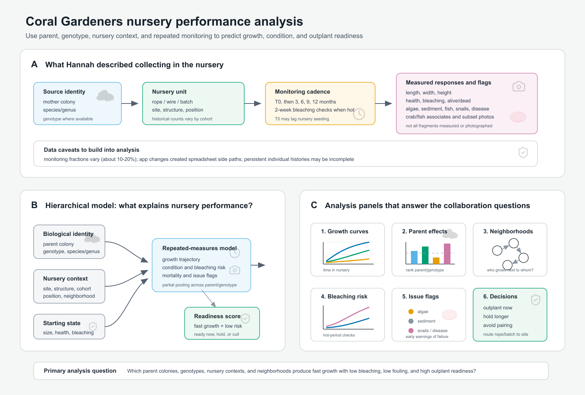

# Nursery performance analysis design

Source: 2026-08-04 Coral Gardeners strategy meeting with Adrian Stier and Hannah Stewart.

Related files:

- [Meeting notes](2026-08-04-coral-gardeners-strategy-meeting.md)
- [Data inventory](summary.md)
- [Raw Otter transcript](2026-08-04-coral-gardeners-strategy-meeting-transcript.txt)
- [Nursery performance analysis figure](nursery-performance-analysis-figure.svg)
- [Nursery performance analysis figure, PNG](nursery-performance-analysis-figure.png)
- [Curated vector icon sources](assets/icons/README.md)

## Purpose

This figure translates the nursery-data section of the transcript into an analysis design. The immediate opportunity is to use Coral Gardeners' existing nursery monitoring to learn which parent colonies, genotypes, nursery contexts, and neighborhoods produce fast growth, low mortality, low bleaching risk, low fouling, and high outplant readiness.

This is not primarily a nursery-infrastructure experiment. Hannah described wire versus rope as an ongoing Coral Gardeners comparison. For this collaboration, infrastructure should enter the nursery analysis as context, a covariate, or a cohort effect, while the main questions are about coral performance and operational decisions.

## Transcript basis

Hannah described the core nursery data stream near the beginning of the transcript: parent or mother-colony identity, nursery rope or wire structure, fragment counts, monitoring at T0 and roughly 3, 6, 9, and 12 months, high-frequency bleaching checks once conditions get hot, dimensions, health and bleaching scores, alive/dead state, issue flags, associate flags, and subset photographs.

Key transcript anchors:

- Nursery data collected: transcript lines 1-20.
- Nursery and outplant analysis questions: transcript lines 136-164.
- Nursery residence time and throughput pressure: transcript lines 89-125.
- Neighborhood, density, size, and taxon-specific competition questions: transcript lines 166-206.

## Data Hannah described collecting in the nursery

Identity and provenance:

- Mother/source colony identity for nursery fragments.
- Species, genus, and genotype where available.
- Fragment count per source colony.
- Possible source-colony health and bleaching scores if linked from collection records.

Nursery context:

- Nursery site.
- Rope, wire, batch, or structure assignment.
- Cohort or seeding event.
- Position on structure if available.
- Local neighborhood: nearby fragments, same versus different parent colony, same versus different genotype, taxonomic mix, density, and contact or overgrowth potential.

Time:

- Nursery seeding date where available.
- T0 monitoring date, with the caveat that T0 may lag true seeding by weeks or months.
- Full monitoring at roughly 3, 6, 9, and 12 months.
- Bleaching monitoring about every two weeks once hot conditions begin.

Responses:

- Length, width, and height.
- Derived size or volume proxy.
- Health score.
- Bleaching score.
- Alive/dead state.
- Issue flags, including algae, sediment, fish, snails, disease, and mortality.
- Crab/fish associate flags.
- Top-down photographs for a subset of nursery corals.

Pre-outplant link:

- Final pre-outplant size or volume.
- Health and bleaching state before deployment.
- Symbiont status if recorded.
- Rope or batch assigned to outplant cell, bommie, or restoration area.

## Questions the analysis should answer

1. Which parent colonies or genotypes grow fastest in the nursery after accounting for site, cohort, structure, and starting size?
2. Which parent colonies or genotypes have low mortality, low bleaching response, and fewer issue flags?
3. Does nursery neighborhood matter: do some taxa, parents, or genotypes perform worse when adjacent, mixed, or crowded?
4. What is the nursery residence-time tradeoff: when does extra nursery growth stop paying off because mortality, bleaching, disease, or center die-off risk increases?
5. Do early health, bleaching, fouling, sediment, snail, or disease flags predict later decline?
6. Can pre-outplant nursery condition predict aggregate restoration outcomes even when individual outplants are not tracked?
7. Can the nursery data support a practical rule such as "this rope goes here," "hold this batch longer," or "do not place these parents/genotypes together"?

## Analysis design

Start with a schema and provenance audit. The first deliverable should be a clean event-level table with one row per observed fragment, rope, batch, or monitoring unit per monitoring event, depending on the finest reliable unit in the database. Required fields are source identity, nursery unit, site, cohort, monitoring date, monitoring type, size measurements, health state, bleaching state, alive/dead status, and issue flags.

Derive common variables:

- `days_since_seed` and `days_since_t0`.
- `nursery_age_months`.
- `structure_type`, with rope/wire treated as context.
- `size_proxy`, likely based on length x width x height or a species-specific volume approximation.
- `growth_rate`, using log-size change where repeated measurements allow it.
- `issue_any`, `fouling_any`, `disease_any`, and other flag summaries.
- `neighborhood_density`, `same_parent_fraction`, `same_genotype_fraction`, `taxonomic_diversity`, and contact/adjacency metrics where spatial records allow them.
- `ready_for_outplant`, either observed from operational decisions or modeled from size, health, bleaching, mortality risk, and issue flags.

Model growth with a repeated-measures mixed model. If individual fragment IDs are reliable, model fragment growth through time with random effects for parent colony, genotype, rope/batch, and cohort. If individual histories are incomplete, model rope- or batch-level mean size and growth, weighted by the number of fragments observed. Include site, cohort, structure type, nursery age, starting size, and neighborhood metrics as predictors.

Model survival and condition separately. Survival can be modeled as a binomial or discrete-time hazard process. Health and bleaching scores should be treated as ordinal responses if the full 1-5 scale is reliable, or converted into biologically meaningful thresholds if scoring consistency is limited. Issue flags can be modeled as separate binary outcomes or combined into fouling, predation/associate, disease, and mortality categories.

Estimate parent/genotype performance with partial pooling. Parent colonies and genotypes should be treated as random effects at first, so rankings are shrunk toward the mean when sample sizes are small. The output should be an estimated performance distribution for each parent/genotype, not a raw leaderboard.

Analyze neighborhoods as compatibility rather than just density. The main neighborhood metrics should distinguish crowding from identity: same parent/genotype neighbors, different parent/genotype neighbors, same genus neighbors, mixed genus neighborhoods, and close contacts. The target question is whether some combinations reduce growth or increase mortality, not merely whether dense ropes perform poorly.

Turn model outputs into decision tools. The most useful product is a rope, batch, parent, or genotype score that combines expected growth, survival probability, bleaching risk, issue-flag risk, and readiness for outplanting. That score can feed operational decisions about outplant timing, placement, and whether particular parents or genotypes should be mixed or separated.

## Figure logic

Panel A lists the nursery data Hannah described in the transcript and makes the main data limitations explicit: partial monitoring, uncertain monitoring fraction, lagged T0, and database/app transitions.

Panel B shows the statistical structure. Biological identity, nursery context, and starting state feed a repeated-measures model of growth, condition, bleaching, mortality, and issue flags. The model then produces an outplant-readiness score.

Panel C shows the concrete analytical outputs: growth curves, parent/genotype effects, neighborhood compatibility, bleaching risk, issue-flag warnings, and operational decisions.

## Near-term deliverables

1. Confirm the database schema and the finest reliable tracking unit: individual fragment, rope, batch, parent colony, or site-cohort.
2. Produce a nursery-data coverage report: number of observations by site, cohort, parent colony, genotype, monitoring date, and monitoring type.
3. Build first-pass growth and survival models for the most complete Moorea nursery dataset.
4. Add health, bleaching, and issue-flag models once scoring vocabulary and completeness are confirmed.
5. Test neighborhood effects where position or adjacency data are available.
6. Create a prototype readiness score for each rope, batch, parent colony, or genotype.
7. Link nursery performance summaries to outplant cells or restoration areas where provenance is good enough.

## Data caveats to preserve

- T0 is not always true T0 because nursery seeding can take months.
- Not all nursery corals are measured or photographed.
- Hannah was unsure whether the monitored fraction is 10%, 20%, or metric-dependent.
- Coral Gardeners does not consistently follow individuals after outplanting.
- App/database transitions created temporary spreadsheet side paths and possible gaps.
- Outplant outcomes are currently more aggregate and lower-frequency than nursery observations.
