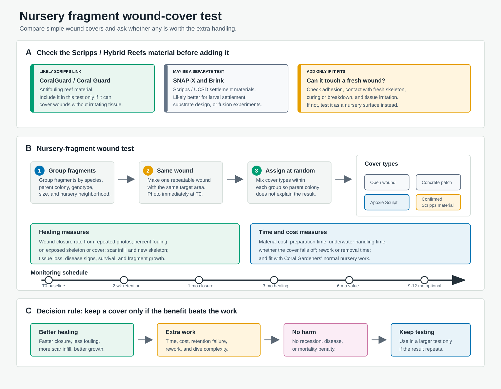

# Nursery fragment wound-treatment experiment

Purpose: design a small, practical nursery experiment to test whether covering standardized coral wounds improves healing enough to justify extra material cost and handling time.

Current status: possible later experiment discussed with Hannah. The active collaboration focus remains ROI/KPI, nursery performance, and imperfect-provenance outplant modeling.

Figure assets: [curated vector icon sources](assets/icons/README.md); [icon preview sheet](wound-treatment-icon-options.png).

## Core idea

Use nursery fragments from known parent colonies/genotypes, create a standardized wound on each fragment, apply one of the candidate wound treatments, and track tissue recovery, fouling, skeletal accretion, health, and cost/time.

The experiment should separate two mechanisms:

1. **Barrier effect:** Does covering exposed skeleton reduce algal/sediment/fouling pressure and speed tissue closure?
2. **Material effect:** Do different materials help, harm, or persist differently once applied underwater or in nursery conditions?

## Treatments

1. **Naked/open wound control**

   Exposed skeleton is left untreated. This is the baseline for natural wound closure and fouling. It is essential because the practical question is whether adding material is worth the cost.

2. **Concrete**

   Tests a cheap mineral cover. Main concern is whether it adheres well, stays in place, and avoids creating rough surfaces that trap sediment or algae.

3. **Apoxie Sculpt epoxy**

   Product: [Aves Apoxie Sculpt - 2 Part Modeling Compound, 1 lb, White/Stone White](https://www.amazon.com/Apoxie-Sculpt-White-modeling-compound/dp/B0013UDWXI).

   Tests the epoxy currently used by Adrian. Main concerns are cure state, adhesion, handling time, possible tissue irritation at the margin, and whether the material becomes a fouling surface.

4. **Scripps / Hybrid Reefs biomaterial candidate**

   Working assumption: this is most likely Daniel Wangpraseurt's Scripps/UCSD Hybrid Reefs **CoralGuard** material, rather than SNAP-X or Brink, because CoralGuard is tied to antifouling plugs/tiles, tissue growth, fragment fusion, and reskinning. The fit is promising but uncertain. CoralGuard may be the right material if the main wound-failure pathway is algal or sediment fouling of exposed skeleton, but it may be the wrong treatment if it is designed for substrate conditioning rather than direct wound coverage. Main unknowns are formulation, intended use, availability, preparation, underwater handling, persistence, live-tissue irritation, and permitting or safety constraints.

5. **Optional unwounded handling reference**

   Healthy fragments are handled, photographed, and returned without wounding. This is not a wound treatment, but it helps separate treatment effects from handling and nursery-position effects.

## Experimental unit and blocking

The experimental unit should be the nursery fragment. Because genotype and parent colony likely matter, treatments should be randomized within blocks wherever possible.

Recommended blocking variables:

- Species or genus.
- Parent colony or genotype.
- Initial fragment size class.
- Nursery structure or rope/wire.
- Position/neighborhood in the nursery.
- Collection or nursery cohort.

Best design if material is available and appropriate for wound coverage: for each parent colony/genotype, assign replicate fragments across all four wound treatments. That keeps genotype from being confounded with treatment.

Before the full experiment, run a small formulation check for the Scripps/Hybrid Reefs candidate. Confirm whether the material is CoralGuard, SNAP-X, Brink, or another formulation; test whether it can be applied consistently to the wound geometry; and remove it from the wound-cover trial if its intended use is really a plug/tile, larval-settlement, or fragment-fusion substrate. In that case, it should become a separate substrate/fusion experiment rather than a wound-treatment arm.

Minimum viable design: within each species/genus and size class, randomize fragments from multiple parent colonies across treatments, then include parent colony as a random or blocking effect in the analysis.

## Wound standardization

The wound needs to be large enough to measure, but small enough that mortality is not the expected outcome.

Design rules:

- Create the same wound area on every experimental fragment.
- Put the wound in a comparable position on each fragment, avoiding tips if tips have different growth dynamics.
- Photograph immediately after wounding and after treatment application.
- Record wound area from the T0 photograph.
- Record treatment footprint area and thickness where possible.
- Record application time per fragment.
- Record whether the treatment fully covers the exposed skeleton, partially covers it, or overlaps live tissue.

Practical wound options:

- A standardized circular scrape or drill mark exposing bare skeleton.
- A standardized clipped branch end or cut face if that better mimics nursery fragmentation.
- A standardized side scar if the goal is to mimic source-colony sampling wounds.

The choice should match the biological question. If the question is nursery-fragment recovery after handling or fragmentation, use a cut-face wound. If the question is donor-colony wound repair, use a side-scar geometry.

## Measurements

### Primary measurements

- **Treatment retention:** present/absent, percent retained, displacement, cracking, peeling, or overgrowth.
- **Wound closure:** percent exposed skeleton remaining; tissue margin advance; days or weeks to closure.
- **Fouling:** percent wound/treatment area covered by turf algae, macroalgae, cyanobacteria, sediment, sponges, worms, bivalves, or other invertebrates.
- **Skeletal accretion:** visible scar infill, raised skeletal growth over or around the wound, vertical relief, or calcification proxy.
- **Survival and condition:** alive/dead, health score, bleaching score, disease signs, tissue recession beyond the wound.
- **Operational cost:** material cost, preparation time, underwater handling time, failure/reapplication rate.

### Secondary measurements

- Fragment length, width, height, and volume proxy.
- Branch extension or total fragment growth.
- Color or bleaching index from standardized photos.
- Associates such as crabs, fish, snails, or other invertebrates.
- Neighbor identity and distance, if nursery layout can be reconstructed.
- Sediment load or local fouling pressure by nursery position.

## Measuring skeletal accretion carefully

Skeletal accretion is valuable, but added materials can make it tricky.

Do not rely on raw buoyant weight alone unless treatment material mass and water absorption can be accounted for. Concrete and epoxy add non-skeletal mass and may change buoyancy differently through time.

Better options:

- Use standardized close-up photos to score visible skeletal infill at the wound margin.
- Use photogrammetry or macro-image depth/relief if available.
- Use a small endpoint subset where material can be removed or sectioned to inspect skeletal infill.
- Use calcein or alizarin staining if feasible and permitted, then examine new growth at the scar margin.
- Use buoyant weight only as a whole-fragment growth metric, with treatment as a covariate and material blanks deployed in the nursery to estimate material mass changes.

If resources are limited, the most robust field-ready accretion endpoint is likely a photo-derived wound-closure and scar-infill score, plus total fragment size change.

## Fouling measurements

Fouling should be treated as a primary response, not just a note. A material could fail because it becomes a better settlement surface for algae or invertebrates, even if it initially covers the wound well.

Recommended fouling variables:

- Percent fouled area of the original wound/treatment footprint.
- Fouling category: turf algae, macroalgae, cyanobacteria, sediment, sponge, worm tube, bivalve, other invertebrate.
- Time to first fouling.
- Maximum fouling observed.
- Whether fouling contacts live tissue.
- Whether fouling is associated with tissue recession.

## Sampling schedule

Suggested schedule:

- T0 immediately after wounding and treatment.
- 2 weeks for retention and early fouling.
- 1 month for early wound closure.
- 3 months for main healing comparison.
- 6 months for persistence, complete closure, skeletal accretion, and operational value.
- Optional 9 and 12 months if wounds heal slowly or if Coral Gardeners wants alignment with existing follow-up intervals.

The 2-week visit is important because material failure and fouling may happen before a 3-month survey.

## Sample-size logic

The design should prioritize balanced replication across parent colonies/genotypes over a large but confounded treatment comparison.

Recommended target if feasible:

- 4 treatments.
- 8-12 parent colonies/genotypes.
- 3-5 fragments per treatment per parent colony/genotype.
- Total: 96-240 wounded fragments, plus optional unwounded handling references.

Lean version:

- 4 treatments.
- 6 parent colonies/genotypes.
- 3 fragments per treatment per parent colony/genotype.
- Total: 72 wounded fragments.

If material or nursery space is limiting, keep all four treatments but reduce replicate fragments per genotype. Dropping genotype balance would make the result much harder to interpret.

## Analysis sketch

Primary models:

- Wound closure over time as a repeated-measures response.
- Fouling probability and fouled area by treatment and time.
- Survival or failure by treatment.
- Skeletal accretion/scar-infill by treatment at 3 and 6 months.
- Operational cost per successfully healed fragment.

Important model terms:

- Treatment.
- Time.
- Treatment x time.
- Initial wound area.
- Initial fragment size.
- Species/genus.
- Parent colony/genotype as a block or random effect.
- Nursery structure/position.
- Neighborhood or local fouling pressure if available.

Key contrasts:

- Any cover versus naked/open wound.
- Apoxie Sculpt versus concrete.
- Scripps/Hybrid Reefs candidate versus simple physical covers.
- Best ecological outcome versus best cost-adjusted outcome.

## Decision criteria

A treatment is only useful if it improves biological outcomes enough to justify operational costs.

Possible go/no-go criteria:

- Higher wound closure by 3 or 6 months than naked/open wounds.
- Lower fouling or delayed fouling relative to naked/open wounds.
- No increase in tissue recession, bleaching, disease, or mortality.
- Treatment remains attached through the biologically relevant healing period.
- Cost and handling time are low enough for Coral Gardeners staff to use at restoration scale.
- The treatment does not create a later removal problem.

## Main risks

- Material mass confounds skeletal accretion measurements.
- Treatments differ in how much they cover live tissue versus exposed skeleton.
- Parent colony/genotype effects swamp material effects if randomization is poor.
- Nursery position and neighborhood drive fouling more strongly than treatment.
- The best biological treatment may be operationally too slow or expensive.
- Wounds may be too small to detect treatment differences or too large to be ethical/useful.

## Bottom line

The clean experiment is a randomized, blocked nursery-fragment wound trial. The primary comparison is naked/open wound versus concrete, Apoxie Sculpt, and the Scripps/Hybrid Reefs candidate only if that candidate is appropriate for direct wound treatment. The primary measurements should be wound closure, fouling, skeletal accretion/scar infill, condition, survival, treatment retention, and cost/time. The analysis should ask not only "which treatment heals best?" but "which treatment gives the best ecological improvement per unit effort?" If CoralGuard is mainly a substrate or fragment-fusion technology, it should be tested in a separate nursery-substrate experiment instead of forced into the wound-cover design.
